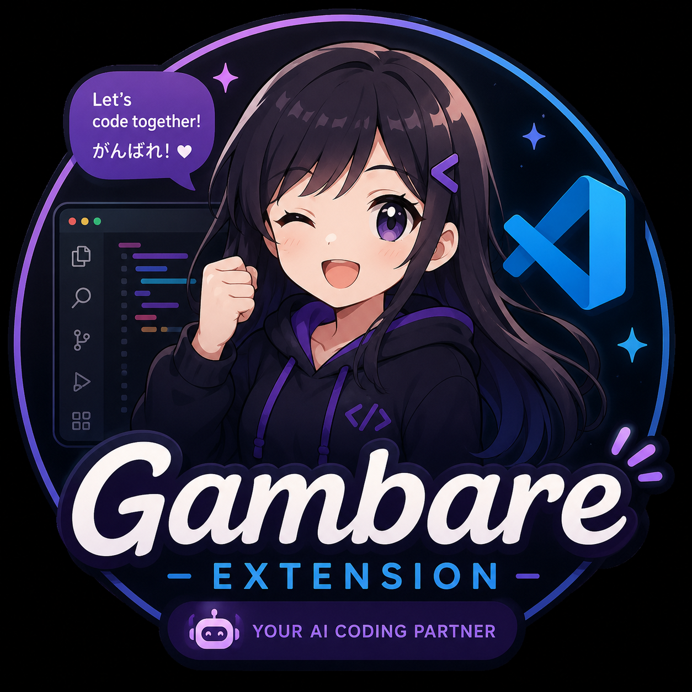

  
  
  # Gambare Companion
  **Your Coding Partner — An Interactive Live2D Anime Assistant for VS Code**

  

## Overview

**Gambare Companion** brings a fully animated, emotionally expressive Live2D anime companion right into your VS Code workspace. "Gambare" (がんばれ) means "Do your best!" in Japanese, and that's exactly what this extension is designed to help you do!

Whether you're debugging a stubborn error, staring blankly at a screen for too long, or finally fixing a broken build, your companion reacts to your coding state in real-time with **Voicevox-powered audio**, fully lip-synced Live2D animations, and bilingual speech bubbles.

## ✨ Features

- **Live2D WebGL Character**: High-quality, smooth 2D animations right in your editor. The companion (Shizuku) breathes, blinks, and reacts dynamically to your environment.
- **Context-Aware Reactions**:
  - 💥 **Errors**: Shakes her head nervously when syntax errors pile up.
  - 🎉 **Fixed Code**: Bounces happily and cheers you on when you resolve issues.
  - 💤 **Idle/Stuck**: Gently encourages you if you haven't typed anything for a while.
- **Voicevox Audio Integration**: Fully synthesized Japanese voice lines powered by Voicevox. Every reaction is fully voiced and lip-synced perfectly to her Live2D animations!
- **Bilingual Subtitles**: Every voice line comes with a matching speech bubble containing both the original Japanese phrasing and its English translation.
- **Interactive**: Click on her for shy and embarrassed interactions!
- **Copilot Integration (Coming Soon)**: Hooks into VS Code's Copilot APIs to provide active AI-driven coding feedback.

## 🚀 Getting Started

1. Install **Gambare Companion** from the VS Code Marketplace.
2. Open the Command Palette (`Ctrl+Shift+P` / `Cmd+Shift+P`).
3. Type `Gambare: Focus Companion` to open her in the bottom panel, or simply click the **Gambare** icon in your Activity Bar (sidebar).
4. Start coding! Watch her react as you write and fix code.

## ⚙️ Configuration

You can customize the companion's behavior in your VS Code Settings (`Ctrl+,`):

*   `GambareCompanion.enabled`: Enable or disable the companion entirely. (Default: `true`)
*   `GambareCompanion.voiceEnabled`: Enable or disable the Voicevox spoken audio. (Default: `true`)
*   `GambareCompanion.voicePitch`: Adjust the pitch of the companion's voice. (Default: `1.3`)
*   `GambareCompanion.voiceRate`: Adjust the speed of the companion's voice. (Default: `0.75`)

## 🛠️ Technology Stack

- **VS Code Extension API**: For workspace monitoring (Diagnostics, Idle tracking).
- **PixiJS & Live2D**: WebGL rendering engine and Live2D framework for high-framerate, CSP-compliant character rendering.
- **Voicevox**: AI voice synthesis for high-quality, expressive Japanese voice lines.
- **TypeScript & HTML/CSS**: Fully typed backend and a responsive, glassmorphic UI overlay for the webview.

---

  <i>Let's code together! がんばれ！</i>

